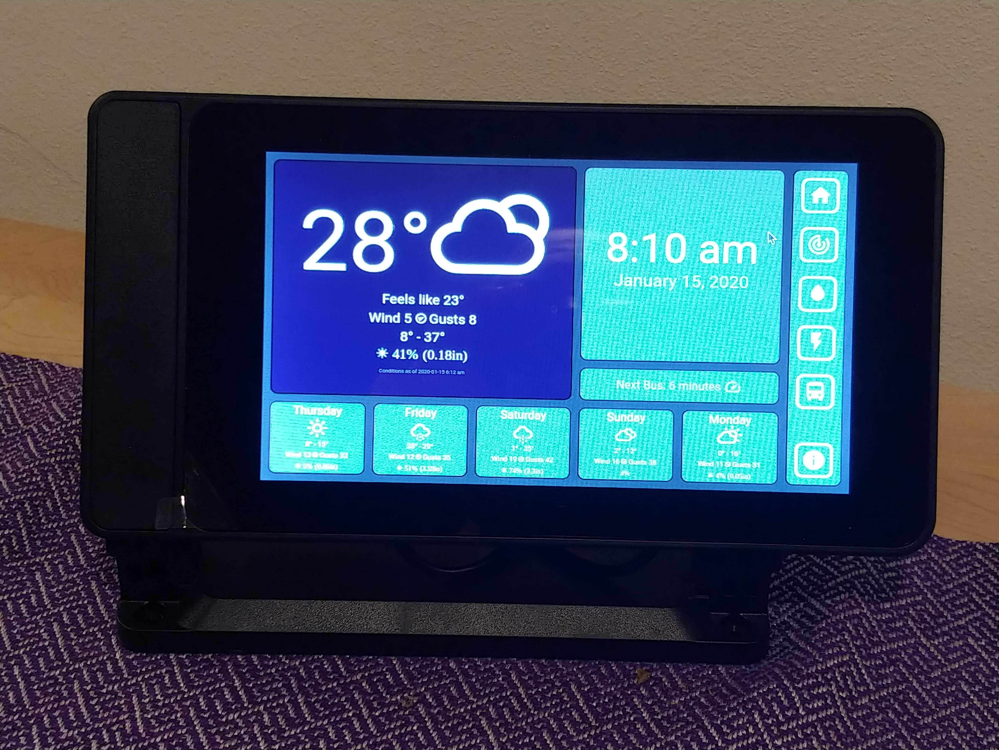

# Weather



"Weather" is an app designed to run on a Raspberry Pi touchscreen kiosk.  It provides current weather conditions, 5 day weather forecast, and current transit status.

## Usage
See the [Documentation](./Documentation/Usage)

## Startup
```batchfile
set darkSkyKey=xxxxxx
set mctsKey=yyyyy
cd Weather/Server
npm run start &
cd ../Client
ng serve &
chromium-browser --noerrdialogs --incognito --kiosk http://localhost:4200
```

## Installation
Clone the repo:
```
git clone https://github.com/dbm58/Weather.git
```
Resolve dependencies
```
cd Weather/Server
npm install
cd ../Client
npm install
```
See the Startup section (above) to get it running
