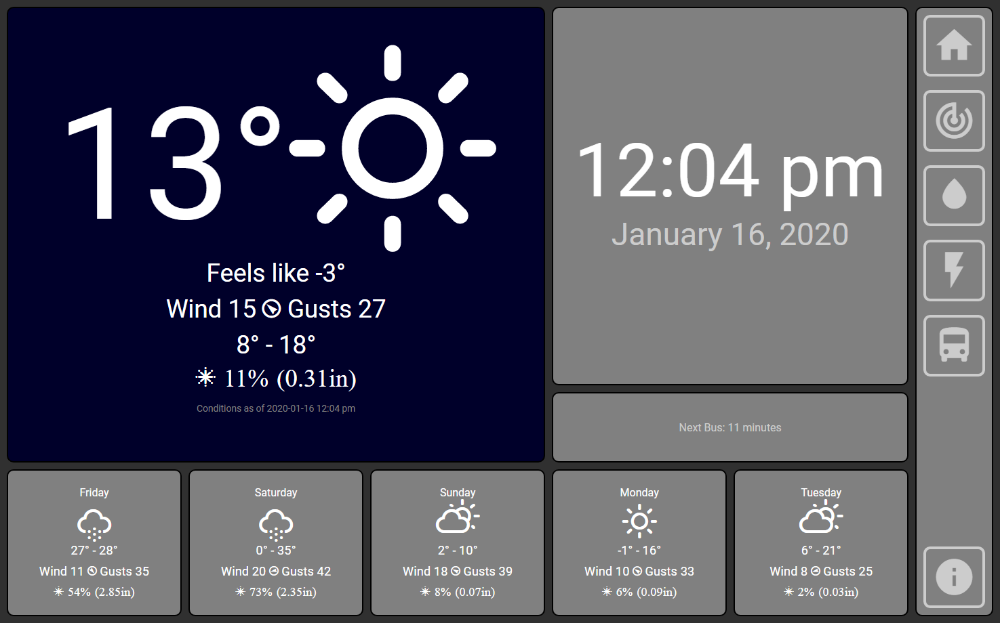

# Weather



"Weather" is an app designed to run on a Raspberry Pi touchscreen kiosk.  It provides current weather conditions, 5 day weather forecast, and current transit status.

## To Install:
* clone
* resolve dependencies

## To Run:
```batchfile
set darkSkyKey=xxxxxx
set mctsKey=yyyyy
npm run weather
```
